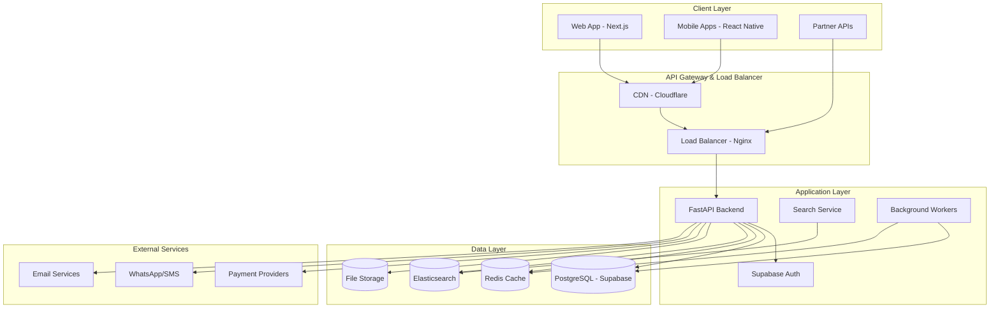
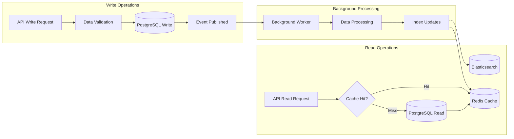
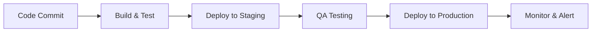
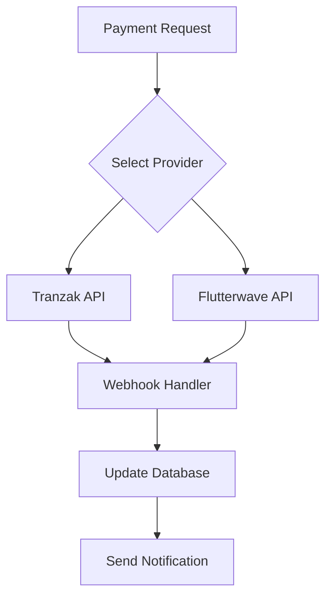
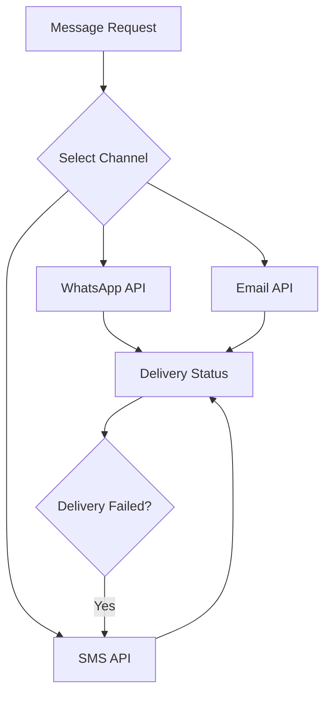

# ✅ Ganitel V2 — Technical Stack & Architecture

This document defines the complete technical architecture, technology choices, and design decisions for the Ganitel multi-service travel platform.

---

## 🏗️ Overall Architecture Philosophy

### **Design Principles**
1. **API-First Architecture**: Backend provides RESTful APIs consumed by multiple frontends
2. **Service-Oriented Design**: Modular services that can scale independently
3. **Mobile-First**: Optimized for African mobile market conditions
4. **Multi-Tenant by Default**: Secure isolation between service providers
5. **Eventual Consistency**: Balance between performance and data consistency
6. **Fail-Safe Design**: Graceful degradation under high load or partial failures

### **Architecture Patterns**
- **Hexagonal Architecture**: Clean separation of business logic from external concerns
- **CQRS (Command Query Responsibility Segregation)**: Separate read and write operations for better performance
- **Event-Driven Architecture**: Asynchronous processing for improved scalability
- **Circuit Breaker Pattern**: Fault tolerance for external service integrations
- **Saga Pattern**: Distributed transaction management across services

---

## 🛠️ Core Technology Stack

### **Backend Framework & Runtime**
| Technology | Version | Justification | Alternatives Considered |
|------------|---------|---------------|------------------------|
| **Python 3.11+** | 3.11.x | Excellent ecosystem, AI/ML libraries, developer productivity | Node.js, Go, Java |
| **FastAPI** | 0.104.x | High performance, automatic API documentation, async support | Django, Flask, Express.js |
| **Uvicorn** | 0.24.x | ASGI server with excellent performance | Gunicorn, Hypercorn |
| **Pydantic** | 2.5.x | Data validation and serialization | Marshmallow, JSONSchema |

### **Database & Data Storage**
| Component | Technology | Version | Use Case | Scaling Strategy |
|-----------|------------|---------|----------|------------------|
| **Primary Database** | PostgreSQL | 15.x | Transactional data, user profiles, bookings | Read replicas, connection pooling |
| **Database Layer** | Supabase | Latest | Managed PostgreSQL, RLS, real-time features | Built-in scaling and backup |
| **Search Engine** | Elasticsearch | 8.x | Service search, analytics | Distributed cluster |
| **Cache Layer** | Redis | 7.x | Session storage, API caching | Redis Cluster |
| **File Storage** | AWS S3 / Cloudinary | Latest | Images, documents, media | CDN integration |
| **Message Queue** | Redis + Celery | Latest | Background jobs, async processing | Horizontal scaling |

### **Authentication & Security**
| Component | Technology | Implementation | Security Level |
|-----------|------------|----------------|----------------|
| **Authentication** | Supabase Auth | JWT tokens, RLS | Enterprise-grade |
| **Password Hashing** | bcrypt | Cost factor 12+ | Industry standard |
| **API Security** | FastAPI Security | OAuth2, JWT, API keys | Production-ready |
| **Data Encryption** | AES-256 | At rest and in transit | Military-grade |
| **SSL/TLS** | Let's Encrypt / Cloudflare | TLS 1.3 minimum | Industry standard |

### **External Integrations**
| Service Category | Provider | Integration Method | Fallback Strategy |
|------------------|----------|-------------------|-------------------|
| **Payments** | Tranzak (Primary) | REST API | Flutterwave backup |
| **Mobile Money** | MTN/Orange | Direct API | Manual processing |
| **SMS/WhatsApp** | Twilio | WhatsApp Business API | SMS fallback |
| **Email** | SendGrid | SMTP/API | AWS SES backup |
| **Maps** | OpenStreetMap | Leaflet.js | Static maps |
| **File Processing** | Cloudinary | REST API | Local processing |

---

## 🏛️ System Architecture

### **High-Level Architecture Diagram**



### **Service Architecture**

```
ganitel-backend/
├── src/
│   ├── api/                    # API layer
│   │   ├── v1/                 # API version 1
│   │   │   ├── auth/           # Authentication endpoints
│   │   │   ├── users/          # User management
│   │   │   ├── services/       # Generic service management
│   │   │   ├── accommodations/ # Accommodation-specific endpoints
│   │   │   ├── vehicles/       # Vehicle rental endpoints
│   │   │   ├── dining/         # Restaurant & dining endpoints
│   │   │   ├── tours/          # Tours & activities endpoints
│   │   │   ├── wellness/       # Wellness & spa endpoints
│   │   │   ├── flights/        # Flight booking endpoints
│   │   │   ├── packages/       # Package management
│   │   │   ├── bookings/       # Booking management
│   │   │   ├── payments/       # Payment processing
│   │   │   ├── cart/           # Shopping cart
│   │   │   ├── search/         # Search & discovery
│   │   │   ├── reviews/        # Reviews & ratings
│   │   │   ├── messages/       # Communication
│   │   │   └── admin/          # Admin operations
│   │   └── middlewares/        # Cross-cutting concerns
│   ├── core/                   # Core business logic
│   │   ├── services/           # Business services
│   │   │   ├── accommodation_service.py
│   │   │   ├── vehicle_service.py
│   │   │   ├── dining_service.py
│   │   │   ├── tour_service.py
│   │   │   ├── wellness_service.py
│   │   │   ├── flight_service.py
│   │   │   ├── package_service.py
│   │   │   ├── booking_service.py
│   │   │   ├── payment_service.py
│   │   │   ├── cart_service.py
│   │   │   ├── search_service.py
│   │   │   ├── review_service.py
│   │   │   ├── message_service.py
│   │   │   └── notification_service.py
│   │   ├── models/             # Data models
│   │   ├── schemas/            # Pydantic schemas
│   │   └── repositories/       # Data access layer
│   ├── infrastructure/         # Infrastructure concerns
│   │   ├── database/           # Database configuration
│   │   ├── cache/              # Caching layer
│   │   ├── search/             # Search engine integration
│   │   ├── storage/            # File storage
│   │   ├── messaging/          # Message queues
│   │   └── external/           # External service integrations
│   ├── utils/                  # Utility functions
│   └── config/                 # Configuration management
├── tests/                      # Test suites
├── migrations/                 # Database migrations
├── scripts/                    # Deployment and utility scripts
├── docker/                     # Docker configurations
├── docs/                       # API documentation
└── requirements/               # Python dependencies
```

---

## 📊 Data Architecture

### **Database Design Philosophy**
- **Single Source of Truth**: PostgreSQL as primary database
- **Read Optimization**: Read replicas for heavy read operations
- **Search Optimization**: Elasticsearch for complex searches
- **Cache Strategy**: Redis for frequently accessed data
- **File Management**: Cloud storage for media and documents

### **Data Flow Architecture**



### **Caching Strategy**
| Data Type | Cache Duration | Cache Key Strategy | Invalidation Strategy |
|-----------|---------------|-------------------|----------------------|
| **User Sessions** | 24 hours | `user:session:{user_id}` | Logout or expiry |
| **Service Listings** | 1 hour | `service:{service_id}` | Service update events |
| **Search Results** | 15 minutes | `search:{hash}` | Time-based expiry |
| **User Profiles** | 6 hours | `user:profile:{user_id}` | Profile update events |
| **Package Data** | 30 minutes | `package:{package_id}` | Package update events |

---

## 🔄 API Architecture

### **RESTful API Design Standards**
- **Resource-Based URLs**: `/api/v1/services/{id}` not `/api/v1/getService`
- **HTTP Methods**: GET (read), POST (create), PUT (update), DELETE (remove)
- **Status Codes**: Consistent use of appropriate HTTP status codes
- **Pagination**: Cursor-based pagination for large datasets
- **Filtering**: Query parameters for filtering and sorting
- **Versioning**: URL-based versioning (`/api/v1/`, `/api/v2/`)

### **API Response Format**
```json
{
  "success": true,
  "data": {
    // Actual response data
  },
  "meta": {
    "pagination": {
      "page": 1,
      "limit": 20,
      "total": 100,
      "has_next": true
    },
    "filters_applied": {},
    "execution_time": "0.123s"
  },
  "errors": null
}
```

### **Error Response Format**
```json
{
  "success": false,
  "data": null,
  "meta": {
    "request_id": "req_123456789",
    "timestamp": "2025-09-18T10:30:00Z"
  },
  "errors": [
    {
      "code": "VALIDATION_ERROR",
      "message": "Invalid email format",
      "field": "email",
      "details": {}
    }
  ]
}
```

---

## 🚀 Deployment Architecture

### **Environment Strategy**
| Environment | Purpose | Infrastructure | Data Sources |
|-------------|---------|----------------|-------------|
| **Local** | Development | Docker Compose | Local PostgreSQL, Redis |
| **Staging** | Testing & QA | Hostinger VPS | Supabase test instance |
| **Production** | Live platform | Hostinger VPS + CDN | Supabase production |
| **Demo** | Sales & demos | Shared staging | Demo data |

### **Containerization Strategy**
```dockerfile
# Multi-stage Docker build
FROM python:3.11-slim as base
# Base dependencies and security updates

FROM base as dependencies
# Install Python dependencies

FROM dependencies as development
# Development tools and debuggers

FROM dependencies as production
# Production-optimized image
```

### **Deployment Pipeline**


---

## 🔧 Development Tools & Workflow

### **Development Environment**
| Tool | Purpose | Configuration |
|------|---------|--------------|
| **Poetry** | Dependency management | pyproject.toml |
| **Black** | Code formatting | 88 character line length |
| **isort** | Import sorting | Compatible with Black |
| **flake8** | Linting | W503, E203 ignored |
| **mypy** | Type checking | Strict mode |
| **pre-commit** | Git hooks | Format, lint, test on commit |

### **Testing Strategy**
| Test Type | Framework | Coverage Target | Execution |
|-----------|-----------|----------------|-----------|
| **Unit Tests** | pytest | > 90% | Every commit |
| **Integration Tests** | pytest + httpx | > 80% | Every PR |
| **API Tests** | pytest + requests | > 95% | Every release |
| **Performance Tests** | locust | All endpoints | Weekly |
| **Security Tests** | bandit + safety | Full codebase | Daily |

### **Code Quality Gates**
- **Minimum Test Coverage**: 85%
- **Maximum Complexity**: Cyclomatic complexity < 10
- **Security Vulnerabilities**: Zero high/critical
- **Code Duplication**: < 5%
- **Type Coverage**: > 80%

---

## 📡 External Service Architecture

### **Payment Service Integration**


### **Communication Service Integration**


---

## 🔍 Monitoring & Observability

### **Application Monitoring Stack**
| Component | Tool | Purpose | Metrics |
|-----------|------|---------|---------|
| **APM** | New Relic / DataDog | Performance monitoring | Response times, throughput, errors |
| **Logging** | Structured logging | Centralized log management | Error tracking, audit trails |
| **Metrics** | Prometheus + Grafana | Infrastructure monitoring | CPU, memory, disk, network |
| **Alerts** | PagerDuty | Incident management | Critical error notifications |
| **Uptime** | Pingdom / StatusPage | External monitoring | Service availability |

### **Custom Metrics Dashboard**
- **Business Metrics**: Bookings, revenue, conversion rates
- **Technical Metrics**: API performance, database queries, cache hit rates
- **User Experience**: Page load times, error rates, user journeys
- **Security Metrics**: Failed logins, suspicious activities, vulnerability scans

---

## 🛡️ Security Architecture

### **Security Layers**
1. **Network Security**: Firewall, VPN, DDoS protection
2. **Application Security**: Input validation, SQL injection prevention
3. **Authentication Security**: Multi-factor auth, session management
4. **Data Security**: Encryption at rest and in transit
5. **Infrastructure Security**: Regular patching, vulnerability scanning

### **Security Monitoring**
- **Real-time Threat Detection**: Unusual login patterns, brute force attempts
- **Vulnerability Scanning**: Weekly automated scans, immediate critical alerts
- **Audit Logging**: All administrative actions, data access patterns
- **Compliance Monitoring**: GDPR, PCI DSS compliance checks

---

## 📈 Scalability Strategy

### **Horizontal Scaling Plan**
| Component | Current Capacity | Scaling Trigger | Scaling Action |
|-----------|-----------------|-----------------|----------------|
| **API Servers** | 2 instances | CPU > 70% | Auto-scale to 10 instances |
| **Database** | Single instance | Connection limit | Add read replicas |
| **Cache** | Single Redis | Memory > 80% | Redis cluster |
| **Search** | Single node | Index size > 10GB | Elasticsearch cluster |
| **Workers** | 2 workers | Queue length > 100 | Scale to 20 workers |

### **Performance Optimization**
- **Database Query Optimization**: Indexed queries, query plan analysis
- **Caching Strategy**: Multi-level caching, cache warming
- **CDN Optimization**: Static asset delivery, geographic distribution
- **API Optimization**: Response compression, connection pooling
- **Background Processing**: Async task processing, job queues

This comprehensive technical architecture ensures that Ganitel will be built on a solid, scalable, and maintainable foundation that can support the platform's growth from MVP to continental scale.