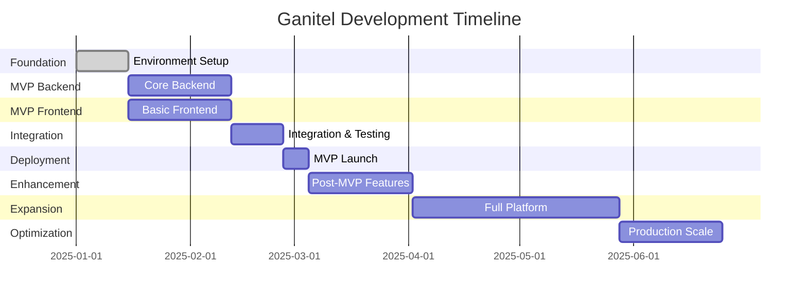

# 🗺️ Ganitel Platform Development Roadmap

**From Zero to MVP, then to Full Platform**

This roadmap breaks down the Ganitel platform development into clear phases, ensuring all team members (Backend, Frontend, DevOps) have synchronized work streams with minimal blocking dependencies.

---

## 📋 Table of Contents

1. [Roadmap Overview](#roadmap-overview)
2. [Team Structure & Responsibilities](#team-structure--responsibilities)
3. [Phase 0: Foundation Setup](#phase-0-foundation-setup)
4. [Phase 1: Core Backend (MVP)](#phase-1-core-backend-mvp)
5. [Phase 2: Basic Frontend (MVP)](#phase-2-basic-frontend-mvp)
6. [Phase 3: MVP Integration & Testing](#phase-3-mvp-integration--testing)
7. [Phase 4: MVP Deployment](#phase-4-mvp-deployment)
8. [Phase 5: Post-MVP Enhancements](#phase-5-post-mvp-enhancements)
9. [Phase 6: Full Platform Features](#phase-6-full-platform-features)
10. [Phase 7: Production Optimization](#phase-7-production-optimization)
11. [Timeline & Dependencies](#timeline--dependencies)
12. [Risk Management](#risk-management)

---

## 🎯 Roadmap Overview

### **MVP Scope: Accommodation Rental Platform**
**Goal:** Launch a working accommodation rental platform where users can browse, book, and pay for accommodations.

**MVP Features:**
- User registration/authentication
- Browse accommodations with filters
- Booking system with calendar
- Payment processing (mobile money)
- Basic provider management
- Admin dashboard

### **Post-MVP: Full Service Marketplace**
**Goal:** Expand to include all services (tours, activities, car rentals, etc.) with advanced features.

---

## 👥 Team Structure & Responsibilities

### **Backend Team (2-3 developers)**
- **Lead Backend Dev:** API design, complex business logic, integrations
- **Junior Backend Dev 1:** CRUD operations, data models, basic endpoints
- **Junior Backend Dev 2:** Testing, documentation, simple features

### **Frontend Team (2-3 developers)**
- **Lead Frontend Dev:** Architecture, complex components, state management
- **Junior Frontend Dev 1:** UI components, pages, responsive design
- **Junior Frontend Dev 2:** Testing, integration, simple features

### **DevOps Team (1-2 engineers)**
- **DevOps Lead:** Infrastructure, CI/CD, monitoring, security
- **Junior DevOps:** Environment setup, deployment scripts, monitoring

---

## 🏗️ Phase 0: Foundation Setup
**Duration:** 2 weeks  
**Goal:** Set up development infrastructure and basic project structure

### **Week 1: Environment & Infrastructure**

#### **DevOps Tasks**
```bash
# Priority 1: Development Environment
□ Set up GitHub repository with branch protection
□ Configure development database (PostgreSQL on cloud)
□ Set up staging environment (basic server)
□ Configure domain and SSL certificates
□ Set up basic monitoring (Uptime, logs)

# Priority 2: CI/CD Foundation
□ Create GitHub Actions workflows
□ Set up automated testing pipeline
□ Configure deployment scripts
□ Set up Docker containers for development
```

#### **Backend Tasks**
```bash
# Priority 1: Project Structure
□ Initialize FastAPI project structure
□ Set up virtual environment and dependencies
□ Configure database connection and migrations
□ Implement basic health check endpoint
□ Set up logging and error handling

# Priority 2: Core Models
□ Implement User model and authentication
□ Create Provider model (basic structure)
□ Implement Service model for accommodations
□ Set up database relationships
□ Create initial database migrations
```

#### **Frontend Tasks**
```bash
# Priority 1: Project Setup
□ Initialize React/Next.js project
□ Set up TypeScript configuration
□ Configure UI library (Material-UI/Tailwind)
□ Set up routing structure
□ Configure API client (Axios/React Query)

# Priority 2: Basic Components
□ Create layout components (Header, Footer)
□ Build authentication components (Login, Register)
□ Set up form validation library
□ Create basic loading and error components
```

### **Week 2: Basic Functionality**

#### **Backend Tasks**
```bash
# Priority 1: Authentication System
□ Implement JWT authentication
□ Create user registration endpoint
□ Implement login/logout endpoints
□ Add password hashing and validation
□ Create user profile endpoints

# Priority 2: Basic CRUD
□ Implement accommodation CRUD endpoints
□ Add image upload functionality
□ Create basic search and filtering
□ Implement input validation schemas
□ Add basic error handling
```

#### **Frontend Tasks**
```bash
# Priority 1: Authentication Flow
□ Build registration form
□ Create login page
□ Implement authentication context
□ Add protected route components
□ Create user profile page

# Priority 2: Basic UI
□ Build homepage layout
□ Create accommodation listing page
□ Implement search and filter components
□ Add responsive design
□ Set up navigation structure
```

#### **DevOps Tasks**
```bash
# Priority 1: Development Workflow
□ Configure development database backups
□ Set up environment variable management
□ Create development deployment pipeline
□ Configure log aggregation
□ Set up basic security scanning
```

### **Phase 0 Deliverables**
- ✅ Working development environment
- ✅ Basic project structure for both frontend and backend
- ✅ User authentication working end-to-end
- ✅ Basic accommodation listing (hardcoded data)
- ✅ CI/CD pipeline for development environment

---

## 🔧 Phase 1: Core Backend (MVP)
**Duration:** 4 weeks  
**Goal:** Complete backend API for accommodation rental MVP

### **Week 3-4: Core Business Logic**

#### **Backend Lead Tasks**
```bash
# Priority 1: Booking System
□ Design booking data model and relationships
□ Implement booking creation with validation
□ Add availability checking logic
□ Create booking status management
□ Implement booking cancellation logic

# Priority 2: Payment Integration
□ Integrate Tranzak mobile money API
□ Implement payment processing logic
□ Add payment status tracking
□ Create payment webhooks
□ Implement refund logic
```

#### **Backend Junior 1 Tasks**
```bash
# Priority 1: Accommodation Management
□ Complete accommodation CRUD operations
□ Implement accommodation image management
□ Add accommodation search and filtering
□ Create accommodation availability calendar
□ Implement accommodation rating system

# Priority 2: Provider Management
□ Create provider registration flow
□ Implement provider verification system
□ Add provider profile management
□ Create provider dashboard endpoints
□ Implement provider accommodation management
```

#### **Backend Junior 2 Tasks**
```bash
# Priority 1: Testing & Documentation
□ Write unit tests for all services
□ Create integration tests for APIs
□ Set up API documentation with Swagger
□ Create database seed scripts
□ Implement data validation tests

# Priority 2: Support Features
□ Implement email notification system
□ Add WhatsApp notification integration
□ Create admin user management
□ Implement basic reporting endpoints
□ Add audit logging
```

### **Week 5-6: Advanced Features & Integration**

#### **Backend Lead Tasks**
```bash
# Priority 1: Advanced Booking Features
□ Implement booking pricing calculation
□ Add seasonal pricing support
□ Create discount and promotion system
□ Implement group booking logic
□ Add booking modification functionality

# Priority 2: Security & Performance
□ Implement rate limiting
□ Add API key authentication for providers
□ Create comprehensive error handling
□ Implement caching for frequent queries
□ Add database query optimization
```

#### **Backend Junior 1 Tasks**
```bash
# Priority 1: Search & Discovery
□ Implement advanced accommodation search
□ Add geolocation-based filtering
□ Create recommendation system
□ Implement accommodation comparison
□ Add accommodation review system

# Priority 2: User Experience
□ Create user booking history
□ Implement user preferences
□ Add user wishlist functionality
□ Create user notification preferences
□ Implement user support ticket system
```

#### **Backend Junior 2 Tasks**
```bash
# Priority 1: Quality Assurance
□ Complete API testing suite
□ Add performance testing
□ Create load testing scripts
□ Implement monitoring and alerting
□ Add comprehensive logging

# Priority 2: DevOps Support
□ Create database migration scripts
□ Implement backup and restore procedures
□ Add health check endpoints
□ Create deployment validation scripts
□ Implement feature toggles
```

### **Phase 1 Deliverables**
- ✅ Complete backend API for accommodation rental
- ✅ Working booking system with payment processing
- ✅ Provider management system
- ✅ Comprehensive test suite (80%+ coverage)
- ✅ API documentation and development guides

---

## 🎨 Phase 2: Basic Frontend (MVP)
**Duration:** 4 weeks (Parallel with Phase 1)  
**Goal:** Complete frontend application for accommodation rental MVP

### **Week 3-4: Core User Interface**

#### **Frontend Lead Tasks**
```bash
# Priority 1: Main User Flows
□ Design and implement accommodation browsing
□ Create accommodation detail pages
□ Build booking flow with calendar integration
□ Implement payment flow UI
□ Create user dashboard and booking management

# Priority 2: State Management & API Integration
□ Set up global state management (Redux/Zustand)
□ Implement API integration layer
□ Create error handling and loading states
□ Add form validation and submission
□ Implement authentication state management
```

#### **Frontend Junior 1 Tasks**
```bash
# Priority 1: UI Components
□ Build accommodation card components
□ Create search and filter UI components
□ Implement responsive grid layouts
□ Build form components (registration, booking)
□ Create navigation and menu components

# Priority 2: User Interface Polish
□ Implement responsive design across all pages
□ Add loading animations and skeleton screens
□ Create consistent styling and theme
□ Implement image galleries and carousels
□ Add accessibility features (ARIA, keyboard navigation)
```

#### **Frontend Junior 2 Tasks**
```bash
# Priority 1: Testing & Quality
□ Set up frontend testing framework (Jest, React Testing Library)
□ Write unit tests for components
□ Create integration tests for user flows
□ Implement end-to-end testing with Cypress
□ Add visual regression testing

# Priority 2: Performance & SEO
□ Implement code splitting and lazy loading
□ Optimize images and assets
□ Add SEO meta tags and structured data
□ Implement Progressive Web App features
□ Add performance monitoring
```

### **Week 5-6: Advanced Features & Integration**

#### **Frontend Lead Tasks**
```bash
# Priority 1: Advanced User Features
□ Implement real-time booking availability
□ Add map integration for accommodation locations
□ Create advanced search with filters
□ Implement user review and rating system
□ Add social sharing features

# Priority 2: Provider Interface
□ Build provider registration and verification flow
□ Create provider dashboard for managing accommodations
□ Implement provider booking management
□ Add provider analytics and reporting
□ Create provider profile management
```

#### **Frontend Junior 1 Tasks**
```bash
# Priority 1: User Experience Enhancement
□ Implement push notifications
□ Add offline support for key features
□ Create user onboarding flow
□ Implement help and support chat
□ Add multi-language support preparation

# Priority 2: Mobile Optimization
□ Optimize mobile user experience
□ Implement touch gestures and interactions
□ Add mobile-specific features (camera, location)
□ Create mobile-first responsive design
□ Test on various mobile devices
```

#### **Frontend Junior 2 Tasks**
```bash
# Priority 1: Integration Testing
□ Complete end-to-end testing suite
□ Add cross-browser testing
□ Implement automated visual testing
□ Create performance testing
□ Add security testing (XSS, CSRF)

# Priority 2: Documentation & DevOps
□ Create component documentation (Storybook)
□ Write deployment and build documentation
□ Implement frontend monitoring and analytics
□ Add error tracking and reporting
□ Create troubleshooting guides
```

### **Phase 2 Deliverables**
- ✅ Complete frontend application for accommodation rental
- ✅ Responsive design working on all devices
- ✅ Integration with backend APIs
- ✅ Comprehensive testing suite
- ✅ Performance optimized application

---

## 🔗 Phase 3: MVP Integration & Testing
**Duration:** 2 weeks  
**Goal:** Integrate frontend and backend, comprehensive testing

### **Week 7: Integration & Bug Fixes**

#### **Full Team Tasks**
```bash
# Priority 1: Integration Testing
□ Frontend-Backend API integration testing
□ End-to-end user flow testing
□ Payment system integration testing
□ Cross-browser compatibility testing
□ Mobile device testing

# Priority 2: Bug Fixes & Polish
□ Fix integration bugs and issues
□ Optimize API response times
□ Polish user interface and user experience
□ Fix accessibility issues
□ Optimize mobile performance
```

#### **DevOps Tasks**
```bash
# Priority 1: Staging Environment
□ Set up staging environment identical to production
□ Configure staging database with test data
□ Set up staging payment processing (sandbox)
□ Implement staging deployment pipeline
□ Configure staging monitoring and logging

# Priority 2: Testing Infrastructure
□ Set up automated testing environments
□ Configure load testing infrastructure
□ Implement security testing pipeline
□ Set up performance monitoring
□ Create backup and disaster recovery procedures
```

### **Week 8: User Acceptance Testing**

#### **Testing Team Tasks**
```bash
# Priority 1: User Acceptance Testing
□ Create test scenarios and user stories
□ Conduct manual testing of all user flows
□ Test edge cases and error scenarios
□ Validate business logic and calculations
□ Test security features and authentication

# Priority 2: Performance & Load Testing
□ Conduct load testing with expected user volumes
□ Test payment system under load
□ Validate database performance
□ Test mobile app performance
□ Conduct security penetration testing
```

#### **Development Team Tasks**
```bash
# Priority 1: Critical Bug Fixes
□ Fix high-priority bugs found in testing
□ Optimize performance bottlenecks
□ Resolve security vulnerabilities
□ Fix mobile-specific issues
□ Address accessibility concerns

# Priority 2: Final Polish
□ Implement final UI/UX improvements
□ Add missing error handling
□ Complete documentation
□ Finalize admin features
□ Prepare go-live checklist
```

### **Phase 3 Deliverables**
- ✅ Fully integrated MVP application
- ✅ All critical bugs fixed
- ✅ Performance optimized
- ✅ Security tested and validated
- ✅ Ready for production deployment

---

## 🚀 Phase 4: MVP Deployment
**Duration:** 1 week  
**Goal:** Deploy MVP to production and go live

### **Week 9: Production Deployment**

#### **DevOps Lead Tasks**
```bash
# Priority 1: Production Infrastructure
□ Set up production servers and database
□ Configure production domain and SSL
□ Set up production payment processing
□ Implement production monitoring and alerting
□ Configure production backup systems

# Priority 2: Deployment & Launch
□ Deploy backend API to production
□ Deploy frontend application to production
□ Configure CDN for static assets
□ Set up database migrations for production
□ Implement production logging and monitoring
```

#### **Development Team Tasks**
```bash
# Priority 1: Launch Support
□ Monitor application performance during launch
□ Provide immediate bug fixes if needed
□ Support user onboarding and initial usage
□ Monitor payment system and transactions
□ Gather user feedback and analytics

# Priority 2: Post-Launch Optimization
□ Optimize based on real user data
□ Fix minor bugs and issues
□ Improve user experience based on feedback
□ Monitor system performance and scaling
□ Prepare for user growth and scaling
```

### **Phase 4 Deliverables**
- ✅ MVP live in production
- ✅ Users can register, browse, book, and pay for accommodations
- ✅ Providers can manage their accommodations
- ✅ Monitoring and alerting in place
- ✅ Support processes established

---

## 📈 Phase 5: Post-MVP Enhancements
**Duration:** 4 weeks  
**Goal:** Improve MVP based on user feedback and add essential features

### **Week 10-11: User Experience Improvements**

#### **Based on User Feedback**
```bash
# Priority 1: User Experience
□ Improve booking flow based on user feedback
□ Add more detailed accommodation information
□ Improve search and filtering capabilities
□ Add user reviews and ratings system
□ Implement user communication features

# Priority 2: Provider Experience
□ Improve provider dashboard and management tools
□ Add provider analytics and reporting
□ Implement provider communication features
□ Add accommodation pricing management
□ Create provider support tools
```

### **Week 12-13: Additional Features**

#### **High-Value Features**
```bash
# Priority 1: Advanced Booking Features
□ Implement package deals and discounts
□ Add group booking capabilities
□ Create booking modification and upgrades
□ Add loyalty program foundation
□ Implement referral system

# Priority 2: Platform Features
□ Add admin dashboard with comprehensive analytics
□ Implement content management system
□ Add customer support ticketing system
□ Create marketing tools for providers
□ Add social media integration
```

### **Phase 5 Deliverables**
- ✅ Improved user experience based on real feedback
- ✅ Enhanced provider tools and analytics
- ✅ Additional booking features
- ✅ Foundation for full platform expansion

---

## 🌟 Phase 6: Full Platform Features
**Duration:** 8 weeks  
**Goal:** Expand beyond accommodations to full service marketplace

### **Week 14-17: Service Expansion**

#### **New Service Types**
```bash
# Priority 1: Tours & Activities
□ Extend data models for tours and activities
□ Implement tour booking system with schedules
□ Add tour guide management
□ Create activity search and discovery
□ Implement tour review and rating system

# Priority 2: Car Rentals
□ Implement car rental data models
□ Add car availability and booking system
□ Create car rental search and filtering
□ Implement car rental pricing and insurance
□ Add car rental provider management
```

#### **Advanced Features**
```bash
# Priority 1: Multi-Service Booking
□ Implement cart system for multiple services
□ Add package creation and management
□ Create custom itinerary building
□ Implement cross-service discounts
□ Add travel planning tools

# Priority 2: Enhanced User Features
□ Add user travel history and profiles
□ Implement travel recommendations
□ Create social features and travel sharing
□ Add travel document management
□ Implement travel insurance integration
```

### **Week 18-21: Platform Optimization**

#### **Performance & Scalability**
```bash
# Priority 1: Technical Improvements
□ Implement advanced caching strategies
□ Add database optimization and sharding
□ Implement microservices architecture
□ Add API rate limiting and throttling
□ Create comprehensive monitoring

# Priority 2: Business Features
□ Add revenue sharing and commission system
□ Implement advanced analytics and reporting
□ Create marketing automation tools
□ Add customer segmentation and targeting
□ Implement A/B testing framework
```

### **Phase 6 Deliverables**
- ✅ Full service marketplace (accommodations, tours, cars)
- ✅ Advanced booking and package features
- ✅ Comprehensive provider and admin tools
- ✅ Scalable architecture for growth

---

## 🎯 Phase 7: Production Optimization
**Duration:** 4 weeks  
**Goal:** Optimize for scale, performance, and business growth

### **Week 22-25: Scale & Growth**

#### **Technical Optimization**
```bash
# Priority 1: Performance
□ Implement advanced caching (Redis, CDN)
□ Optimize database queries and indexing
□ Add horizontal scaling capabilities
□ Implement load balancing
□ Add advanced monitoring and alerting

# Priority 2: Security & Compliance
□ Implement advanced security measures
□ Add data protection and privacy compliance
□ Create comprehensive audit logging
□ Implement fraud detection and prevention
□ Add backup and disaster recovery systems
```

#### **Business Optimization**
```bash
# Priority 1: Analytics & Intelligence
□ Implement advanced business analytics
□ Add predictive analytics for demand
□ Create dynamic pricing algorithms
□ Implement customer lifetime value tracking
□ Add competitive analysis tools

# Priority 2: Growth Features
□ Implement affiliate and partner programs
□ Add white-label solutions for partners
□ Create API marketplace for third-party integrations
□ Implement advanced marketing automation
□ Add multi-currency and international support
```

### **Phase 7 Deliverables**
- ✅ Highly scalable and performant platform
- ✅ Advanced business intelligence and analytics
- ✅ Growth-ready features and partnerships
- ✅ Enterprise-grade security and compliance

---

## ⏱️ Timeline & Dependencies

### **Critical Path Dependencies**



### **Team Workload Distribution**

#### **Phase 0-1 (Weeks 1-6): Foundation & Core Backend**
- **Backend Team:** 100% utilization - Building core API
- **Frontend Team:** 100% utilization - Building core UI
- **DevOps Team:** 100% utilization - Setting up infrastructure

#### **Phase 2-3 (Weeks 7-8): Integration & Testing**
- **All Teams:** 100% utilization - Integration work
- **Testing Focus:** Quality assurance and bug fixes

#### **Phase 4 (Week 9): MVP Launch**
- **All Teams:** 100% utilization - Launch support
- **On-call Support:** 24/7 monitoring during launch week

#### **Phase 5-7 (Weeks 10-25): Growth & Scale**
- **Backend Team:** Feature development and optimization
- **Frontend Team:** UX improvements and new features
- **DevOps Team:** Scaling and performance optimization

### **Parallel Work Streams**

**Weeks 1-2: Foundation**
- DevOps: Infrastructure setup
- Backend: Project structure and models
- Frontend: Project setup and basic components

**Weeks 3-6: Core Development**
- Backend: API development (parallel work streams)
- Frontend: UI development (parallel with backend)
- DevOps: CI/CD and staging environment

**Weeks 7-8: Integration**
- All teams: Integration testing and bug fixes
- QA: Comprehensive testing
- DevOps: Production preparation

---

## 🚨 Risk Management

### **Technical Risks**

#### **High-Priority Risks**
1. **Payment Integration Delays**
   - **Risk:** Tranzak API integration issues
   - **Mitigation:** Start integration early, have backup payment provider
   - **Owner:** Backend Lead
   - **Timeline:** Week 4

2. **Performance Issues at Scale**
   - **Risk:** Database or API performance problems
   - **Mitigation:** Load testing, optimization, caching strategy
   - **Owner:** DevOps Lead
   - **Timeline:** Week 7-8

3. **Mobile Compatibility Issues**
   - **Risk:** Frontend not working properly on mobile devices
   - **Mitigation:** Mobile-first development, extensive device testing
   - **Owner:** Frontend Lead
   - **Timeline:** Week 5-6

#### **Medium-Priority Risks**
1. **Team Member Unavailability**
   - **Risk:** Key team member becomes unavailable
   - **Mitigation:** Cross-training, documentation, pair programming
   - **Owner:** Project Manager
   - **Timeline:** Ongoing

2. **Third-Party Service Dependencies**
   - **Risk:** External services (email, SMS) become unavailable
   - **Mitigation:** Multiple service providers, graceful degradation
   - **Owner:** Backend Lead
   - **Timeline:** Week 6

### **Business Risks**

#### **High-Priority Risks**
1. **MVP Launch Delays**
   - **Risk:** Missing launch deadline due to technical issues
   - **Mitigation:** Aggressive testing, feature prioritization, rollback plan
   - **Owner:** Project Manager
   - **Timeline:** Week 8-9

2. **User Adoption Issues**
   - **Risk:** Low user adoption after launch
   - **Mitigation:** User testing, feedback integration, marketing preparation
   - **Owner:** Product Manager
   - **Timeline:** Week 10+

### **Mitigation Strategies**

#### **Technical Mitigation**
```bash
# Weekly Risk Assessment
□ Review critical path dependencies
□ Identify blocking issues early
□ Maintain backup plans for integrations
□ Regular performance testing
□ Cross-team knowledge sharing

# Quality Assurance
□ Automated testing at every level
□ Manual testing for critical flows
□ Performance monitoring
□ Security scanning
□ Regular code reviews
```

#### **Process Mitigation**
```bash
# Communication
□ Daily stand-ups for all teams
□ Weekly cross-team sync meetings
□ Bi-weekly stakeholder updates
□ Issue escalation procedures
□ Documentation requirements

# Planning
□ Buffer time in critical phases
□ Parallel development where possible
□ Early integration testing
□ Continuous deployment
□ Feature flag implementation
```

---

## 📊 Success Metrics

### **MVP Launch Success Criteria**
- ✅ 99.9% uptime during first month
- ✅ <2 second page load times
- ✅ Successful payment processing (95%+ success rate)
- ✅ Mobile compatibility (works on 95% of devices)
- ✅ User registration and booking flow completion

### **Business Success Metrics**
- **Week 1:** 100+ user registrations
- **Week 4:** 50+ completed bookings
- **Month 3:** 500+ active users
- **Month 6:** 2000+ active users, break-even point

### **Technical Success Metrics**
- **Code Coverage:** 80%+ test coverage
- **Performance:** <2s API response times
- **Security:** No critical vulnerabilities
- **Scalability:** Handle 1000+ concurrent users
- **Reliability:** 99.9% uptime

---

## 🎯 Quick Reference Guide

### **Daily Standup Questions**
1. What did you complete yesterday?
2. What are you working on today?
3. Any blockers or dependencies?
4. Any risks to timeline?

### **Weekly Team Sync Agenda**
1. Progress review against roadmap
2. Cross-team dependencies
3. Risk assessment and mitigation
4. Next week priorities
5. Resource needs

### **Phase Gate Reviews**
- **Technical Review:** Code quality, test coverage, performance
- **Business Review:** Features complete, user acceptance, business metrics
- **Risk Review:** Issue identification, mitigation status, timeline impact
- **Go/No-Go Decision:** Ready for next phase?

---

**Remember: This roadmap is a living document. Update it based on team feedback, technical discoveries, and business priorities. The key is keeping everyone aligned and productive! 🚀**