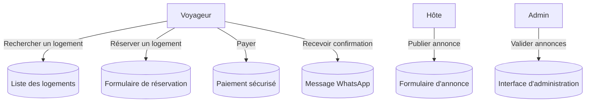
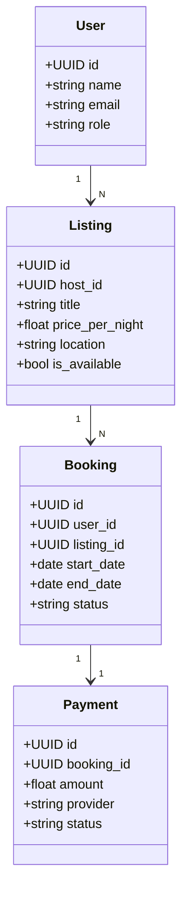
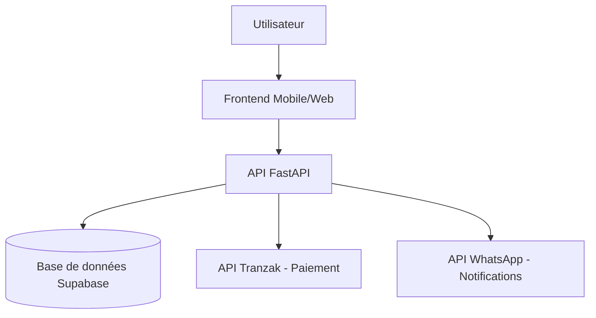
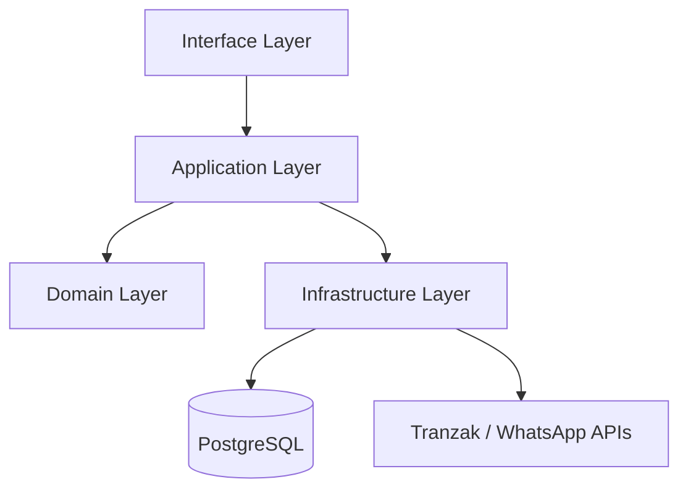
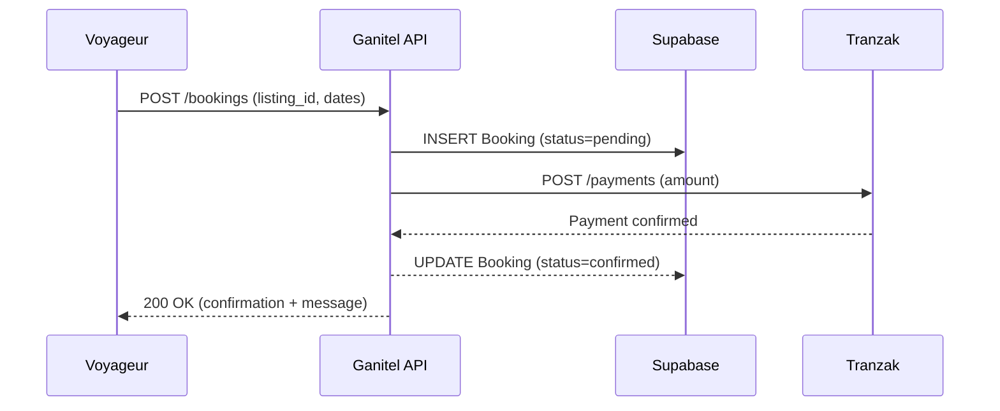
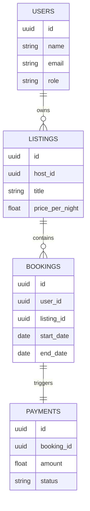

---

# 🧭 Guide  de conception logicielle

*(Exemple : Projet Ganitel)*

---

## 🎯 Objectif du guide

Ce guide décrit la **méthode standard de conception** à suivre dans tous nos projets avant d’entamer le développement.
Il permet de **passer de l’idée à une conception exploitable** : claire, cohérente, et documentée.

Chaque étape aboutit à un **livrable** avec diagrammes et texte.
Une fois tous les livrables validés, le développement peut commencer sans risque de flou.

---

## 🧩 Les 7 livrables essentiels

1. Cas d’utilisation (Use Cases / User Journeys)
2. Modèle de domaine (Domain Model)
3. Architecture logicielle (C4 Model + structure du code)
4. Diagrammes de séquence et flux d’API
5. Modèle de base de données (ERD + SQL)
6. Décisions d’architecture (ADR)
7. Documentation finale de conception

---

## 1️⃣ Cas d’utilisation (Use Cases / User Journeys)

### 🎯 Rôle

Cette étape définit **ce que le système doit faire** du point de vue des utilisateurs.
Elle décrit les **acteurs**, leurs **objectifs**, et les **scénarios d’action** principaux.

C’est la base fonctionnelle du produit.

### 📄 Ce qu’on attend

* Une liste d’acteurs (utilisateur, hôte, admin, système externe).
* Les scénarios pour chaque acteur.
* Un diagramme UML “Use Case”.

### 💡 Exemple — Ganitel

L’acteur principal est le **voyageur**. Son objectif est de **réserver un logement**.

#### Diagramme Mermaid :



#### Scénario textuel :

> 1. Le voyageur recherche une destination et des dates.
> 2. Il consulte la liste des logements disponibles.
> 3. Il sélectionne un logement et clique sur “Réserver”.
> 4. Il procède au paiement via Tranzak.
> 5. Il reçoit une confirmation et un message WhatsApp.

---

## 2️⃣ Modèle de domaine (Domain Model)

### 🎯 Rôle

C’est la représentation conceptuelle du **métier** : les entités, leurs rôles, et leurs relations.
Ce modèle est indépendant de la technologie ; il sert à structurer la logique métier.

### 📄 Ce qu’on attend

* Liste d’entités métier.
* Description des attributs principaux.
* Relations entre entités (1–N, N–N…).
* Diagramme UML de classes.

### 💡 Exemple — Ganitel

Entités principales :
**User**, **Listing**, **Booking**, **Payment**

#### Diagramme Mermaid :



Relations textuelles :

* Un *User (hôte)* possède plusieurs *Listings*.
* Un *Listing* peut avoir plusieurs *Bookings*.
* Un *Booking* est lié à un *Payment*.

---

## 3️⃣ Architecture logicielle (C4 Model + structure du code)

### 🎯 Rôle

L’architecture décrit la **structure technique globale** du projet : les composants, les dépendances et les interactions.
Elle montre comment la logique métier, les services, la base de données et les API externes s’articulent.

### 📄 Ce qu’on attend

* Un **diagramme C4 niveau 2** : vue d’ensemble des containers (API, DB, frontend…).
* Un **diagramme C4 niveau 3** : structure interne du backend.
* Une **arborescence de code** conforme à l’architecture choisie (Clean ou Hexagonal).

### 💡 Exemple — Ganitel

#### Diagramme C4 global :



#### Diagramme C4 interne (Backend) :



#### Arborescence type :

```
app/
  domain/        → entités, modèles, règles métier
  application/   → cas d’usage, orchestrateurs
  infrastructure/→ persistance, APIs externes
  interface/     → routes, contrôleurs, schémas FastAPI
```

---

## 4️⃣ Diagrammes de séquence et flux d’API

### 🎯 Rôle

Ces diagrammes montrent **les interactions dynamiques** : l’ordre exact des appels entre les acteurs, l’API et les services tiers.
Ils garantissent que les flux sont logiques et cohérents avant le codage.

### 📄 Ce qu’on attend

* Un diagramme de séquence pour les 2 à 3 scénarios critiques (réservation, paiement, messagerie).
* Les endpoints REST correspondants.

### 💡 Exemple — Réservation sur Ganitel

#### Diagramme Mermaid :



#### Endpoint REST associé :

```http
POST /api/bookings
{
  "listing_id": 123,
  "start_date": "2025-10-20",
  "end_date": "2025-10-25",
  "payment_method": "mobile_money"
}
```

---

## 5️⃣ Modèle de base de données (ERD + SQL)

### 🎯 Rôle

Cette étape traduit le modèle de domaine en structure physique : les tables, les clés, les index et les relations SQL.

### 📄 Ce qu’on attend

* Un diagramme **ERD clair**.
* Un **fichier SQL ou SQLAlchemy** décrivant les tables.

### 💡 Exemple — ERD Ganitel

#### Diagramme Mermaid :



Ce diagramme doit être accompagné du schéma SQL généré par SQLAlchemy ou Alembic.

---

## 6️⃣ Architecture Decision Records (ADR)

### 🎯 Rôle

Les ADR documentent **les décisions techniques importantes** pour assurer la transparence et la continuité du projet.

### 📄 Ce qu’on attend

* Un dossier `docs/adr/` contenant un fichier `.md` par décision.
* Chaque ADR décrit : le contexte, la décision, les alternatives, et les conséquences.

### 💡 Exemple — Choix de la base de données Ganitel

```md
# ADR 0001 – Choix de la base de données

## Contexte
Nous devons héberger une base relationnelle fiable et simple à déployer pour le MVP.

## Décision
Nous choisissons **Supabase (PostgreSQL managé)**, car :
- il offre une API instantanée,
- une authentification intégrée,
- des sauvegardes automatiques.

## Alternatives rejetées
- SQLite : trop limitée pour les connexions multiples.
- PostgreSQL autohébergé : maintenance lourde.

## Conséquences
Simplifie le MVP, mais limite la flexibilité d’hébergement à long terme.
```

---

## 7️⃣ Documentation finale de conception

### 🎯 Rôle

C’est la **synthèse de tout le travail de conception**.
Elle centralise tous les documents précédents dans un dossier accessible et versionné.

### 📄 Ce qu’on attend

Un dossier `/docs/architecture` contenant :

```
/docs/
  architecture_overview.md
  use_cases.md
  domain_model.md
  sequence_diagrams.md
  database/
    erd.png
  adr/
    0001-database-choice.md
    0002-api-design.md
  README_ARCHITECTURE.md
```

Le fichier `README_ARCHITECTURE.md` doit présenter un sommaire et expliquer le rôle de chaque sous-dossier.

### 💡 Exemple de sommaire :

```md
# Ganitel – Conception Technique

1. Cas d’utilisation – [use_cases.md](use_cases.md)
2. Modèle de domaine – [domain_model.md](domain_model.md)
3. Architecture logicielle – [architecture_overview.md](architecture_overview.md)
4. Flux d’API – [sequence_diagrams.md](sequence_diagrams.md)
5. Modèle de base de données – [database/erd.png](database/erd.png)
6. Décisions techniques – [adr/](adr/)
```

---

## ✅ Fin de la phase de conception

Quand tous ces livrables sont produits et validés :

* Le **produit est clairement défini** (fonctionnellement).
* Le **modèle métier est compris**.
* L’**architecture technique est fixée**.
* Les **flux API sont validés**.
* La **base de données est prête**.
---
