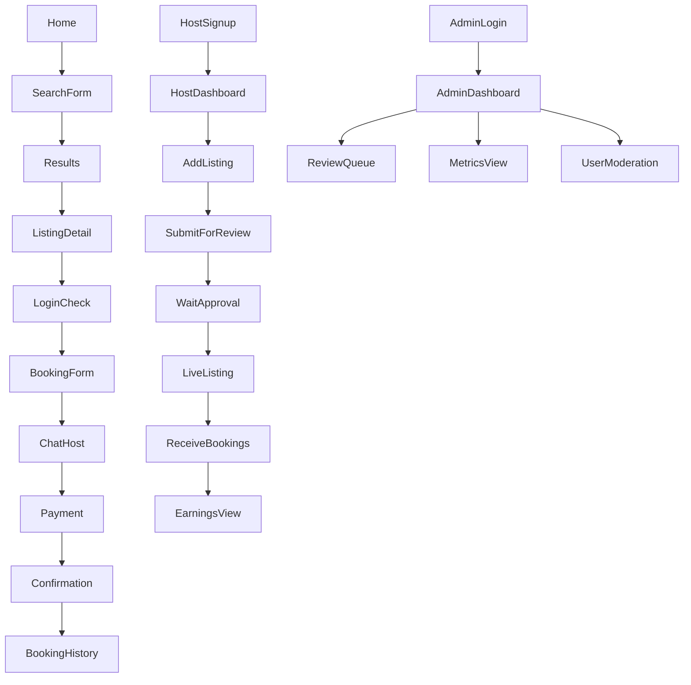

## ✅ Point 5 – UX Flows & User Journeys (Ganitel MVP)

---

### 🧍‍♂️ A. Traveler (Single-Service Booker) — **Booking a lodging**

#### 📌 Objective:

Book a lodging in Cameroon with a clean, mobile-first experience.
**No packages, no multi-service trip yet.**

#### 🔁 User Journey:

```text
1. Landing Page → Homepage
2. Search Form (Destination, Dates, Guests) → Submit
3. Search Results → Click on a listing
4. Listing Detail Page → View images, description, calendar
5. Click "Book Now" →
   - (If logged out: redirect to login/signup OTP screen)
6. Fill in booking info (dates, guests, optional message)
7. (Optional: message host to negotiate price)
8. Confirm → Proceed to payment
9. Payment via Tranzak → Confirmation screen
10. Receive booking confirmation (WhatsApp + Email)
11. View booking in user dashboard
```

#### 🛠 Features Involved:

* Autocomplete search bar
* Internal filter system (dates, guests, neighborhood, amenities)
* Pre-booking chat with host (Twilio WhatsApp)
* Payment with Tranzak
* Booking history view

---

### 🧑‍🍳 B. Host (Service Provider) — **Managing listings**

#### 📌 Objective:

Add and manage one or more lodging listings, accept bookings, communicate with guests.

#### 🔁 User Journey:

```text
1. Go to "Become a Host" page → Sign up (OTP)
2. Access Host Dashboard
3. Add new listing →
   - Title, description, images
   - Availability calendar
   - Amenities, capacity, pricing (including dynamic ranges)
4. Submit for admin approval
5. Once approved → Listing is public
6. Receive booking requests (visible in dashboard)
7. Approve/reject → Optional price negotiation
8. View earnings summary
```

#### 🛠 Features Involved:

* Host dashboard
* Listing creation form (with validations)
* Calendar-based availability
* Price control
* Messaging guest via WhatsApp
* Earnings panel (basic at MVP stage)

---

### 🛡️ C. Admin — **Moderation & Control**

#### 📌 Objective:

Approve listings, moderate users, resolve issues, and have oversight of platform activity.

#### 🔁 Admin Flow:

```text
1. Login (internal access only)
2. Dashboard overview → KPIs, pending reviews
3. Moderate:
   - New listing submissions
   - Reported listings
   - Fraudulent activity
4. View system-wide metrics (bookings, earnings, signups)
5. Manual refunds or booking cancellations
6. Send global communications (optional)
```

#### 🛠 Tools:

* Admin panel (basic CRUD)
* Listings review queue
* User reporting system
* KPIs (number of active users, bookings, etc.)
* Manual intervention capabilities

---

### 🧭 Flow Map Summary (MVP)



