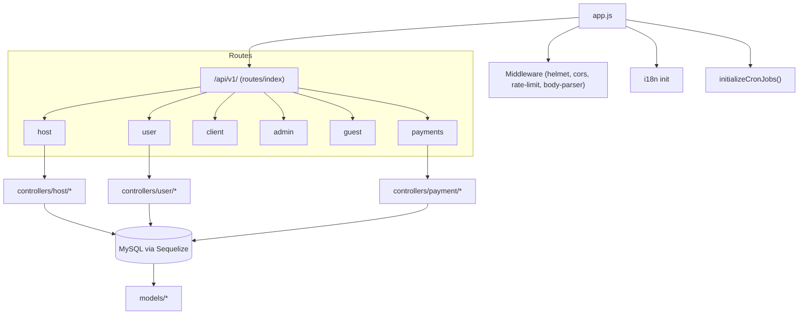
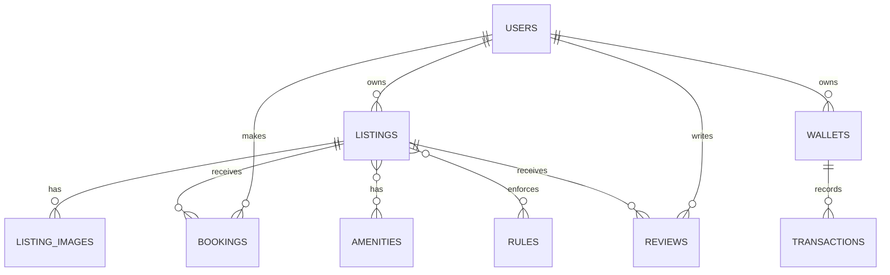
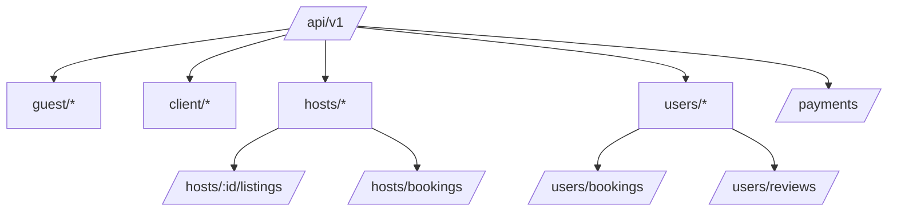

# Diagrams — residence-backend-v2

Paste these Mermaid diagrams into any Markdown viewer or Mermaid live editor to render the architecture and entity relationships.

## High-level architecture

## Key entities (ER diagram - simplified)

## Endpoint map (subset)

