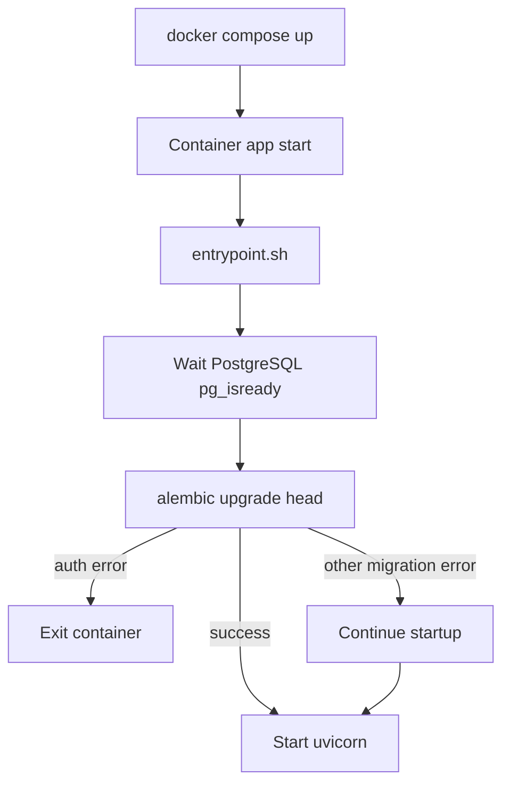

- an admin shouldnt be created that easily. it must be created by another signed in admin ?

- la gestion des erreurs et exceptions n'est pas uniformisee et clairement definie

=====================================================
Je lance un audit ciblé Docker/DB: je vais d’abord cartographier les fichiers de conteneurisation et de config pour vérifier migrations automatiques, credentials et différences local vs staging.

Created 6 todos

Je vais lire en parallèle les fichiers clés (Dockerfile, compose local/staging, entrypoint et migration scripts) pour établir le comportement réel au démarrage.

Read 

Read 

Read 

Read 

Read 

Read 

J’ai confirmé que les migrations sont déclenchées dans entrypoint.sh et que local/staging n’ont pas exactement le même modèle de config. Je vais maintenant vérifier la config applicative (`config.py`, `database.py`, scripts de déploiement) pour l’aspect credentials et connexion DB.

Read 

Read 

Read 

Read , lines 1 to 360

Read 

Je complète l’audit avec les fichiers d’environnement/migrations et scripts de reset pour identifier les causes probables de vos problèmes de credentials et de connexion DB.

Searched for files matching `**/.env*`, 2 matches

Read 

Read 

Read 

Read 

Read , lines 1 to 320

Je vérifie maintenant les fichiers d’exemple d’environnement pour auditer l’hygiène des secrets et le câblage réel des credentials.

Read 

Read 

Read 

Searched for text `@router.get("/health` (`**/app/api/v1/**`), no results

Searched for files matching `**/app/api/v1/endpoints/health.py`, 1 match

Read 

Read 

Created 6 todos

Completed: *Rédiger audit + recommandations* (6/6)

Voici l’audit ciblé sur Docker / Alembic / credentials / DB.

**Verdict**
- Globalement: base correcte, mais pas encore “production-grade” sur la partie secrets et robustesse startup.
- Oui, les migrations Alembic se lancent automatiquement au `up` (local + staging) via l’entrypoint entrypoint.sh + Dockerfile.
- Non, local et staging ne sont pas exactement faits pareil (même image/entrypoint, mais runtime/config assez différents).

**1) Migrations automatiques au `up`**
- `ENTRYPOINT` exécute entrypoint.sh, qui fait `alembic upgrade head`.
- Comportement:
  - `production` -> skip auto-migrations.
  - `staging` + local/dev -> auto-migrations.
- Point critique: si migration échoue (hors erreur d’auth DB), le script continue quand même et démarre l’app -> risque de schéma DB incomplet/dérive.

**2) Credentials (forces/faiblesses)**
- Positif: séparation par fichiers d’env (.env.local, .env.staging) documentée via .env.example et .env.staging.example.
- Faiblesses:
  - Beaucoup de valeurs par défaut faibles (ex: mots de passe fallback dans compose/config) dans docker-compose.local.yml et config.py.
  - Secrets injectés en variables d’environnement “classiques” (pas Docker secrets/Vault) -> visibles via `docker inspect`/process env.
  - `REDIS_PASSWORD` en staging a fallback `changeme` dans docker-compose.staging.yml (dangereux si env mal rempli).
  - config.py contient des defaults sensibles (SECRET_KEY, ADMIN_PASSWORD, etc.) -> risque de mauvais déploiement si env manquante.

**3) Communication avec la base de données**
- Côté infra:
  - `depends_on: service_healthy` + `pg_isready` dans compose.
  - Attente active DB dans entrypoint avant migration (`pg_isready`) entrypoint.sh.
- Côté app:
  - SQLAlchemy pool avec `pool_pre_ping=True`, sessions avec rollback/close dans database.py.
  - Alembic récupère `POSTGRES_*` ou fallback `DATABASE_URL` dans env.py.
- Problème récurrent probable (et déjà anticipé dans le script): changement de mot de passe PostgreSQL avec volume existant -> échec auth tant que volume pas réinitialisé.

**4) Local vs staging: mêmes pratiques ?**
- Commun:
  - Même image Docker + même entrypoint + même logique migration.
- Différences fortes:
  - Local: `env_file: .env.local`, DB/Redis exposés, `db-test`, `pgadmin`, volumes code/tests.
  - Staging: pas `env_file` au niveau service (injecté par `--env-file` du script), Redis avec mot de passe, ressources `deploy` (souvent ignorées hors Swarm), plus orienté “runtime”.
- Donc non, pas identiques; staging est plus strict sur certains points, mais pas assez durci sur d’autres.

**5) Problèmes concrets que je vois (sources probables de vos incidents)**
- `redis` staging: healthcheck sans auth alors que `requirepass` est activé -> peut rester `unhealthy` (docker-compose.staging.yml).
- Script de déploiement teste `/health` au lieu de `/api/v1/health/` -> faux négatifs possibles (deploy-staging.sh vs health.py).
- Migration non bloquante en cas d’échec non-auth -> app démarre possiblement dans un état cassé.
- Incohérences de docs/usage local (hot reload annoncé, mais commande app sans `--reload` par défaut dans compose/docker).

**Recommandations prioritaires (pratiques)**
- P0:
  - Rendre migration **bloquante** en staging (et idéalement prod via job dédié), pas de “continue on error”.
  - Corriger healthcheck Redis staging avec auth.
  - Corriger les URLs de smoke test dans deploy-staging.sh.
- P1:
  - Supprimer les secrets par défaut sensibles dans config.py, forcer présence en staging/prod.
  - Éviter les fallbacks faibles (`changeme`, mots de passe en dur) dans compose.
  - Introduire gestion de secrets (Docker secrets/SSM/Vault au minimum en staging/prod).
- P2:
  - Uniformiser local/staging sur la stratégie de config (et documenter clairement l’ordre de priorité env).

Si tu veux, je peux te proposer un plan de correction en 5 PRs (small safe steps) et te préparer le patch des 3 points P0 directement.

================================================

